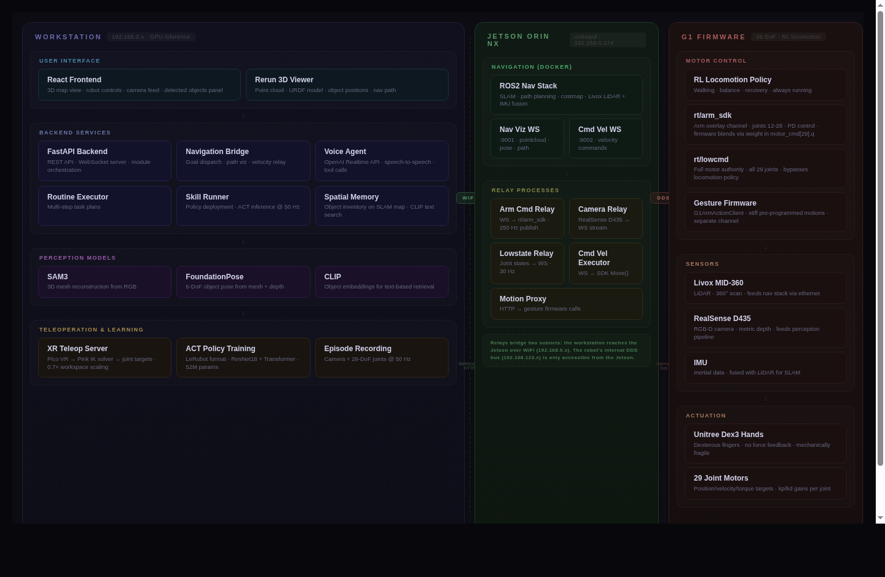
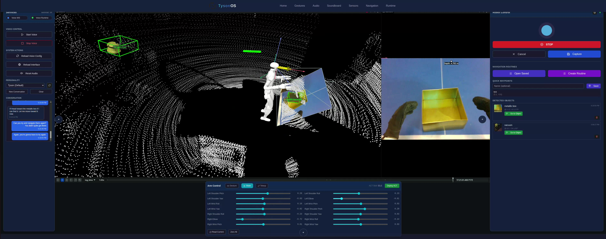
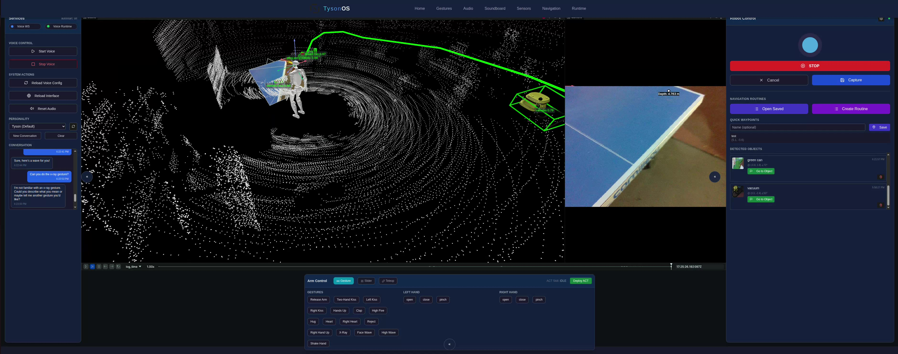
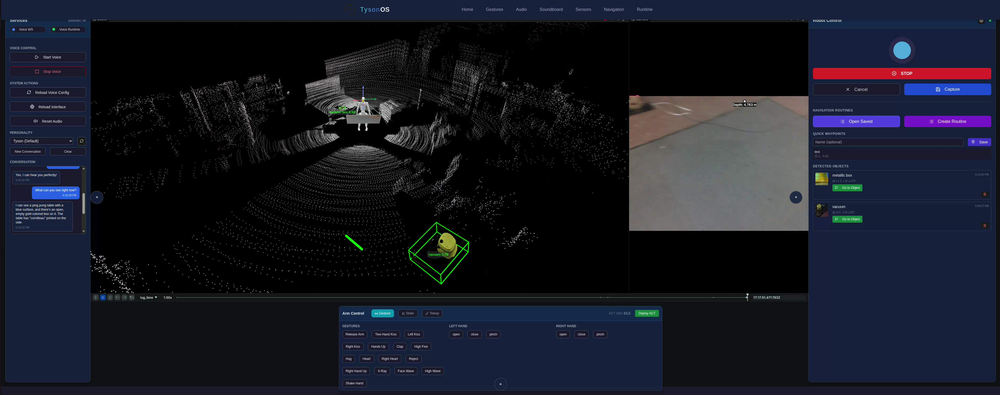

# Building a Software Stack for the Unitree G1 Humanoid

*Pim Van den Bosch*

---

The Unitree G1 is a $16,000 humanoid robot with 29 degrees of freedom. Out of the box, it walks. It waves. It streams sensor data. What it cannot do is see objects, navigate to them, understand speech, or learn new tasks. The gap between a robot that balances and a robot that does useful work is enormous, and almost entirely a software problem.

Between September 2025 and March 2026, I built Robot-OS — the software that bridges that gap. It gives the G1 perception, autonomous navigation, voice interaction, and learned manipulation, running across two machines connected by WiFi. 198 commits, roughly seven months of evenings and weekends, a lot of broken hardware.

This is a description of that system: what it does, how the pieces fit together, and the parts that took longer than they should have.

## What the robot ships with

The G1 runs a reinforcement-learning locomotion policy on its firmware. This handles walking, balance, and recovery from pushes. The firmware also includes a gesture system — pre-programmed motions like handshakes, claps, and waves — accessible through a C++ API. There is a Jetson Orin NX mounted inside the torso, a Livox MID-360 LiDAR on the head, and an Intel RealSense D435 depth camera.

The locomotion policy is good. I never had to touch it. Everything I built sits on top of it.

## Why not ROS?

The standard approach in robotics is to build on ROS — one node per capability, communicating through publish-subscribe. It works. It's also where most of the debugging time goes. When perception publishes stale object positions and navigation plans a path to where the object was three seconds ago, every node is working correctly and the system still fails. The failure mode is in the interfaces, not the components.

Robot-OS uses a monolithic FastAPI backend instead. Every service — voice, vision, navigation, manipulation — lives under one process and shares state directly. When the perception pipeline updates an object's position, the navigation planner sees it immediately, not after serialization through a message queue. A single state machine can coordinate multi-step tasks (navigate, detect, grasp) without the orchestration layer that ROS systems typically need on top.

The trade-off is obvious: less modularity, harder to swap components. In practice, for a system where everything is changing constantly and the integration *is* the hard part, having direct function calls between services saved more time than it cost.

The one exception is the navigation stack itself, which runs ROS2 inside a Docker container on the Jetson — the only piece of the system that uses ROS, isolated because the dependency tree is large enough to justify containment.

## The architecture

The system spans two machines. The Jetson inside the robot handles sensor relay and navigation. A workstation across the room handles everything else: the web frontend, the backend services, perception inference, voice processing, and policy execution. They communicate over WiFi.

This split exists for two reasons. First, the Jetson doesn't have the compute to run SAM3, FoundationPose, and a voice model simultaneously — those are GPU-hungry inference workloads that need a proper workstation GPU. Second, and more fundamentally, the robot's internal communication bus is unreachable from outside.

### The DDS subnet problem

The G1's motors and sensors sit on a DDS (Data Distribution Service) bus locked to a 192.168.123.x subnet. This subnet is only accessible from the Jetson's internal ethernet interface — it's the physical bus that connects to the motor controllers, IMU, and LiDAR inside the robot's body. The workstation lives on a different subnet (192.168.0.x), reachable over WiFi.

The obvious approach is IP forwarding: configure the Jetson as a gateway, route packets from the WiFi subnet to the internal bus, done. I spent a day on this. It doesn't work. The DDS implementation (Cyclone DDS, used by Unitree) embeds the sender's IP address in the protocol payload itself. Messages originating from the wrong subnet get silently dropped by the DDS discovery mechanism, even if they're correctly routed at the IP level. This isn't a misconfiguration — it's a fundamental property of how DDS peer discovery works.

### Relay processes

The solution is relay processes. Five small Python scripts run on the Jetson host (outside Docker), each bridging one data stream between the DDS bus and a WebSocket or HTTP endpoint the workstation can reach:

- **Arm command relay** (port 8097): receives joint position targets from the workstation over WebSocket, publishes them to the `rt/arm_sdk` DDS topic at 250 Hz. This is the critical path for teleoperation and policy execution — any latency here means the robot's arm lags behind the commanded position.

- **Camera relay** (port 8090): captures RGB-D frames from the RealSense D435, JPEG-encodes RGB, base64-encodes depth, and streams both over WebSocket. The workstation's perception pipeline consumes these frames for object detection and pose estimation.

- **Lowstate relay** (port 8096): reads the full joint state (35 motor positions, velocities, and torques) off the DDS bus via raw multicast, and forwards them at 30 Hz over WebSocket. This feeds the Rerun visualization (live URDF rendering) and provides the observation input for ACT policy inference.

- **Velocity command executor** (port 9002, via nav stack): receives `cmd_vel` navigation commands from the ROS2 path follower inside the Docker container, and calls the Unitree SDK's `Move()` function to actually make the robot walk. Without this bridge, the navigation stack can plan paths but the robot won't move.

- **Motion proxy** (port 8095): receives gesture trigger requests over HTTP REST, dispatches them to the firmware's gesture system via the `G1ArmActionClient` DDS interface. This is the simplest relay — fire and forget — but it's separated because gesture execution runs at firmware level with full motor authority, distinct from the `arm_sdk` overlay.

Each relay is independent. If the camera relay crashes, navigation still works. If the arm relay is down, the voice agent can still dispatch gestures through the motion proxy. This fault isolation wasn't a design goal — it fell out of the architecture naturally — but it turned out to be one of the system's best properties.

### The workstation stack

On the workstation side, a single FastAPI process hosts all services:

- **Perception services**: SAM3 segmentation, FoundationPose 6DoF pose estimation, and CLIP embedding — each running in separate conda environments as HTTP microservices, called by the main backend.
- **Spatial memory**: a persistent 3D object database indexed by position and semantic embedding.
- **Voice service**: OpenAI Realtime API integration with wake word detection ("Hey Tyson" — the original project name), running in its own Python environment with a WebSocket relay to the backend.
- **Teleop server**: HTTPS WebSocket server for VR headset connections, processing controller poses through IK.
- **ACT skill runner**: loads trained policies and runs inference at 50 Hz, sending joint targets through the arm relay.
- **Navigation bridge**: receives pointcloud and pose data from the Jetson's nav stack, forwards navigation goals, and streams visualization data to Rerun.

A React frontend provides monitoring and control: live camera feeds, a 2D navigation map with waypoint placement, gesture triggers, voice controls, and sensor readouts. Rerun renders a 3D view with the robot's URDF model at its estimated position, overlaid on the accumulated LiDAR pointcloud.

## The arm control interface nobody documented

Most of the time I spent on this project was fighting the interface between my software and the robot's motors. The Unitree SDK documentation covers the basics. What it doesn't cover is what actually matters when you're trying to do manipulation.

The firmware exposes two DDS topics for motor control:

**`rt/lowcmd`** gives you direct authority over every joint. Position targets, velocity targets, torque, PD gains — all 29 degrees of freedom. The locomotion policy stops running. You control the legs. If your commands are wrong, the robot falls.

**`rt/arm_sdk`** is the overlay channel. You control the arm and waist joints (indices 12–28) while the locomotion policy continues to handle the legs. The firmware blends your commands with its own using a weight parameter stored in `motor_cmd[29].q`, where 1.0 means full external control.

This is the mode you want for manipulation. The robot keeps walking and balancing while you move the arms independently.

Three things I learned through experimentation:

**You must create a fresh message object every publish cycle.** Reusing a stale `LowCmd` object causes the firmware to weaken or ignore arm commands. The Unitree SDK examples always create a new message each tick. This is not an optimization choice.

**You must set kp, kd, q, dq, and tau for every arm and waist joint.** Omitting joints doesn't mean "leave them alone." It means "command them to their default values." Setting PD gains on leg joints in an `arm_sdk` message causes the firmware to reject the entire message.

**The gesture system runs on a completely separate firmware channel.** Gestures produce stiff, forceful motions because they run with full motor authority inside the firmware. The `arm_sdk` overlay has lower torque limits. I measured about 8 Nm of effective shoulder torque through `arm_sdk` with kp=80 — enough to lift the arm overhead, but noticeably weaker than a gesture doing the same motion.

None of this is in the documentation. None of it is in the GitHub issues. Each detail cost hours.

## Perception

The perception pipeline detects objects in the camera feed, estimates their 3D pose, and stores them on the SLAM map. Three models work in sequence:

**SAM3** takes an RGB frame and produces segmentation masks and coarse 3D meshes for each detected object. Mesh quality varies. Mugs and bottles reconstruct well. Irregular shapes usually don't.

**FoundationPose** takes each mesh and a depth image and estimates the object's 6-DoF pose. I first used FoundationPose during an internship at VUB's BruBotics lab. The insight here was that SAM3's mesh output could feed directly into FoundationPose's input, closing the loop from detection to localization without a separate CAD model.

**CLIP** encodes each detection as a vector embedding, stored alongside the object's map position. This enables text search from the frontend: type "red mug" and the system highlights the closest match.

Getting FoundationPose to work within the resource constraints of a single workstation GPU was its own problem. The model wants to eat VRAM for breakfast. I ended up implementing sequential object processing with aggressive memory management — it takes longer per object, but it doesn't crash, and for a robot that processes a scene once before acting, latency per object matters less than robustness.

The pipeline has two unsolved problems:

**Deduplication.** The same mug seen from three angles creates three separate entries. Merging detections across viewpoints requires matching by position and appearance, and the thresholds that work for large objects fail for small ones.

**Identity instability.** An open-vocabulary detector will label an object "coffee mug" once, "ceramic cup" the next time, and segment half the table as an object on the third pass. This inconsistency accumulates over time. Constraining the detector to an expected object list helps, but defeats the purpose of open-vocabulary detection.

These reflect a real gap between single-image detection — which current models handle well — and the persistent spatial inventory a robot actually needs.

## Navigation

Autonomous navigation uses a ROS2 stack running in a Docker container on the Jetson. It fuses LiDAR scans with IMU data for SLAM, computes costmaps, plans paths, and outputs velocity commands.

Two WebSocket channels connect the nav stack to the workstation: one for visualization data (point cloud, robot pose, planned path) and one for velocity commands that the executor forwards to the robot's `Move()` function.

The integration between ROS2's path follower and Unitree's locomotion SDK was non-trivial. The navigation stack outputs `cmd_vel` velocity commands inside the Docker container, but the Unitree SDK can only be called from the Jetson host. The `cmdvel_ws_executor.py` bridge process connects to the container's WebSocket on port 9002, receives velocity commands, and translates them into SDK `Move()` calls. I debugged this chain for an entire weekend before realizing the executor was disabled by a single environment variable (`NAV_EXECUTOR_ENABLED=0`).

The frontend lets you place waypoints on a 2D map, and the robot plans paths to them autonomously, including correct yaw orientation at the destination. The voice agent can also trigger navigation: "Go to the bottle" queries spatial memory for the bottle's position and sends it as a navigation goal.

Visualization bandwidth was a problem. The raw WebSocket broadcast from the nav stack was 6.5 MB per message at 1 Hz — mostly navigation graph and polygon markers that nobody needed. Disabling those fields dropped it to 941 KB at 4 Hz, which made the Rerun pointcloud visualization actually usable.

## Voice control

A voice interface connects the robot to OpenAI's Realtime API for speech-to-speech conversation. The robot listens through a USB microphone on the workstation (the Jetson's audio hardware is limited), and the LLM generates both spoken responses and tool calls.

Available tools include: navigate to a location, trigger a gesture, query spatial memory, and activate a manipulation skill. A routine executor can chain these into multi-step plans — "go to the kitchen, find the mug, pick it up" becomes a sequence of navigation goals, perception queries, and skill activations, orchestrated by a state machine that waits for each action to complete before advancing.

Single-step commands work reliably. Multi-step plans compound errors. If perception, navigation, and manipulation each succeed 85% of the time, a three-step chain succeeds 61% of the time. In practice, the rates are often lower. A navigation goal reached 30 cm off target means the subsequent grasp fails, and the planner doesn't know why.

The bottleneck is not the language model. Current LLMs plan well enough for this kind of task. The bottleneck is the state representation they receive. The planner can only act on what the perception system actually detected, which may not reflect what's in the room.

The hardest part of the voice system was not the language model. It was audio. ALSA device management on Linux, Bluetooth speaker pairing that silently breaks on reboot, microphone gain that clips in any environment louder than a library, echo cancellation between a speaker and a microphone mounted on the same robot. None of this is interesting. All of it has to work.

## Teleoperation: the twelve-hour bug

Before the robot can learn manipulation, it needs training data. Before you can collect training data, you need working teleoperation. This turned out to be the hardest part of the project.

The setup: a Pico VR headset streams controller poses over WebSocket to the workstation. An IK solver converts 6-DoF wrist targets into 14-DoF joint angles. These are sent to the Jetson's arm relay, which publishes them to `rt/arm_sdk`.

The IK solver is Pink, a QP-based velocity IK library built on Pinocchio. It replaced a CasADi/IPOPT solver that was in the original codebase. Pink computes incremental velocity steps toward the target rather than re-solving the full nonlinear problem each frame. The difference: 0.5 ms per step vs 5-15 ms, and much less jitter. It also supports per-joint posture weights, which keep the robot's arm configuration natural instead of drifting into kinematically valid but physically awkward poses.

A 0.7× workspace scaling maps human arm reach to the robot's shorter arms. Without it, extending your arm to 70% of your reach already pushes the robot to its kinematic limits.

After the IK solver, transforms, and scaling were all working correctly, the arms still couldn't lift above chest height. I could command the shoulder pitch to a position above the head. The arm would barely move. But pushing the arm by hand revealed it was compliant — it would hold a position if placed there, then slowly drift back. The motors had authority. Something was preventing them from using it.

I spent twelve hours on this. I replaced the IK solver. Added feed-forward gravity compensation torques. Tuned PD gains. Restructured the coordinate pipeline. Every change was correct. None had any visible effect.

The cause was a velocity clipper buried in the arm relay. The relay's control loop runs at 250 Hz. Each tick, the clipper read the motor's current position and capped how far the commanded position could deviate from it — 0.02 radians maximum. The intent was smooth motion. The effect was that the PD controller never saw more than a tiny position error, so it never generated more than a fraction of available torque. The arm couldn't overcome gravity because the relay was preventing it from trying.

I removed the clipper. The arm lifted above the head on the first try.

## Learning manipulation

With teleoperation working, the pipeline is: collect demonstrations through VR, convert to training format, train a policy, deploy it.

I collected 50 episodes of a pick task using rubber grippers (the Dex3 hands had broken during earlier teleop sessions — no force feedback means you can't feel when fingers hit a surface). Each episode records the head camera feed and 29-DoF joint positions at 50 Hz, stored as operator-commanded targets.

The recordings convert to LeRobot format for training an ACT (Action Chunking with Transformers) policy. Given a camera image and current joint state, the policy predicts a chunk of future joint positions. 52 million parameters — ResNet18 vision backbone plus transformer decoder. Training on 50 episodes for 100k steps takes about 45 minutes on an RTX 5090. Loss drops from 7.7 to below 0.1.

Deployment uses the same arm relay as teleoperation. The skill runner moves the arms to a start pose, then runs inference at 50 Hz: read camera, read joints, predict action chunk, send targets. The policy runs until a termination condition or timeout.

The Dex3 hands deserve a mention. They're mechanically capable but not designed for this kind of abuse. Multiple fingers broke during data collection. When a thumb pin snapped, I measured it, modeled a replacement in CAD, and had a local CNC shop machine new ones. The hands are not designed to be disassembled. You learn the internals by breaking them.

## What the system looks like end to end

In the demo configuration, a user says "pick up the red mug." The voice agent queries spatial memory, retrieves the object's position, sends a navigation goal, waits for arrival, then activates the pick policy. Each step works individually. Chaining them reliably is the open problem.

This isn't a surprising result. It's the expected state of a system where every component is early-stage and the interfaces between them are thin. What the system demonstrates is the structure: what layers a humanoid robot OS needs, how they connect, and where the failure modes live.

## Three things I'd change

**Standardize on containers from the start.** The microservice architecture happened because SAM3, FoundationPose, ROS2, and the voice model all need different Python environments. I solved the conflicts reactively with separate processes and Docker. Designing the communication interfaces first would have saved significant debugging.

**Build a proper spatial memory layer.** The current system stores object positions at detection time and never updates them. Objects move. The robot moves. A useful spatial inventory needs to track objects over time, merge observations, and handle uncertainty. This is a well-studied problem in robotics. Integrating it with foundation-model detectors is not.

**Interpolate between teleop commands.** The VR headset sends targets at 30 Hz. The arm relay runs at 250 Hz. Sending raw IK output directly to the motors produces visible vibration. A simple interpolation buffer would smooth this, improving both the teleoperation experience and the quality of collected training data.

---

*Pim Van den Bosch — robotics, simulation, whole-body control. Based in Belgium.*
